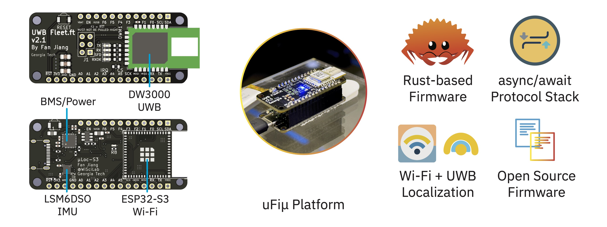

# The muFiu Firmware



This is the firmware of the muFiu wireless research platform. To run the firmware, please refer to the `esp-rs` toolchain manual.

# Repositories

* Firmware: This repository
* Hardware (ESP32-S3 Node): https://github.com/ProfFan/MagicLoc-S3-HW
* Hardware (DWM3000 Carrier): https://github.com/ProfFan/MagicLoc-DWM3000
* Central (Parses serial messages from the firmware): https://github.com/ProfFan/magic-loc-central
* Protocol: `magic-loc-protocol`

# LICENSE

```
Copyright 2023 Fan Jiang

Licensed under the Apache License, Version 2.0 (the "License");
you may not use this file except in compliance with the License.
You may obtain a copy of the License at

    http://www.apache.org/licenses/LICENSE-2.0

Unless required by applicable law or agreed to in writing, software
distributed under the License is distributed on an "AS IS" BASIS,
WITHOUT WARRANTIES OR CONDITIONS OF ANY KIND, either express or implied.
See the License for the specific language governing permissions and
limitations under the License.
```

